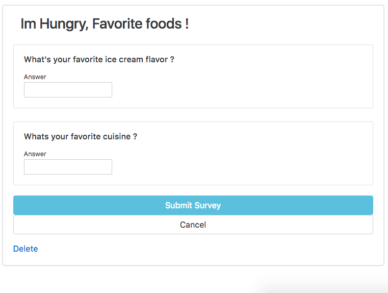
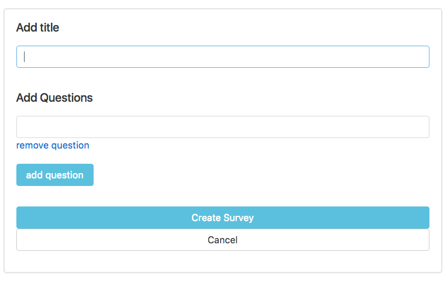

# Rails5 nested Questionnaire

This app simulates a survey experience. As an Admin, You can create surveys with many open ended questions.
As users fill out surveys, the answers are recorded and can be viewed and monitored by the admin at any point.
As a user, you can view the list of surveys & take a survey after signing in.

[Visit The Demo here.](https://polar-island-11573.herokuapp.com/users/sign_in)

to login with an admin account. Please use the following.
```
email address: admin@survey.com  password: password
```





* Key Gems

Cocoon - As I began building out the schema, I realized that surveys would need to accept nested attributes for questions.
After looking into cocoon, I learned that this was a good way to leverage jquery to build dynamic forms into a rails app.  

rails_admin - I was tasked with finding a simple solution for monitoring a users survey answer.
It is a pretty powerful gem that gives you a lot of functionality.  Create an admin account and view user behavior from there.
